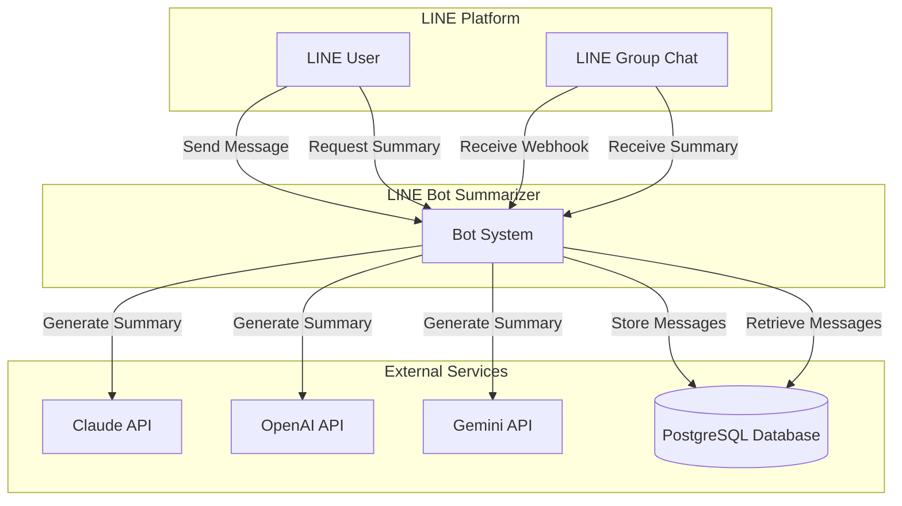
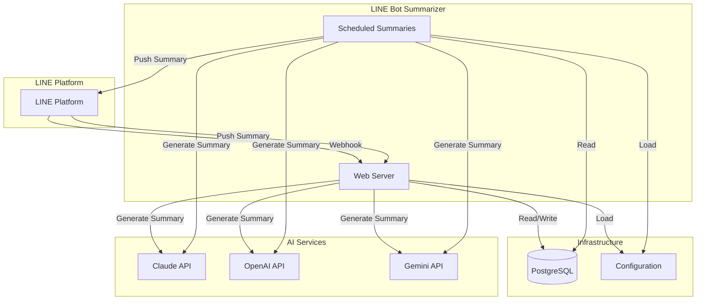
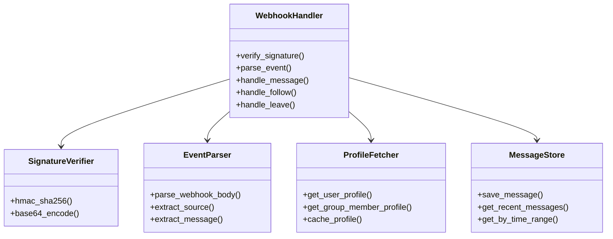
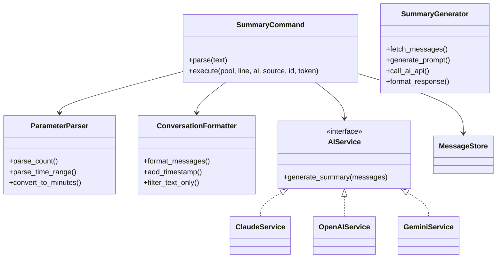
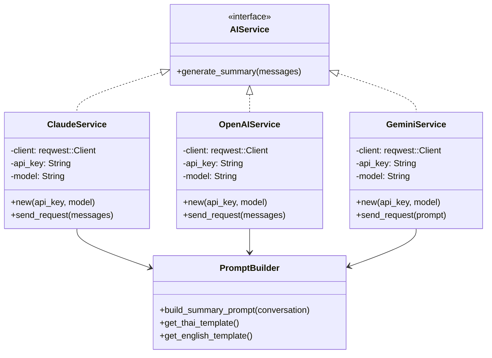
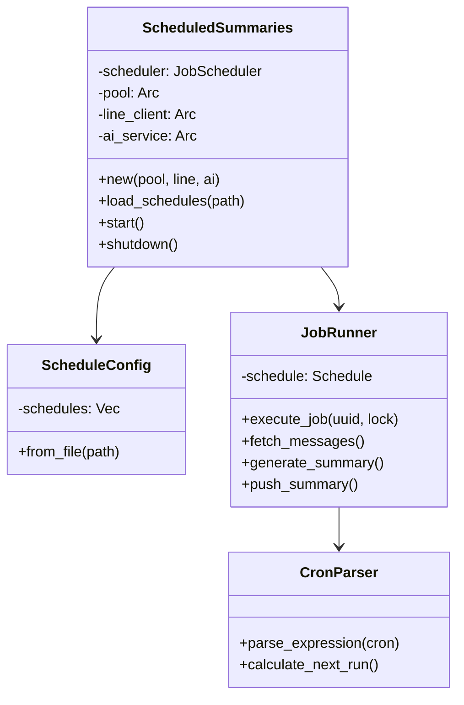
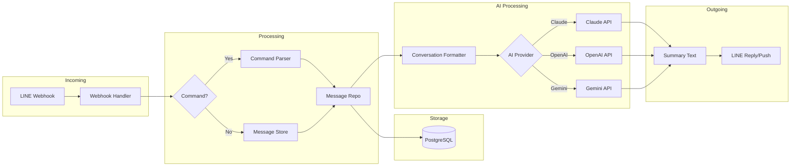
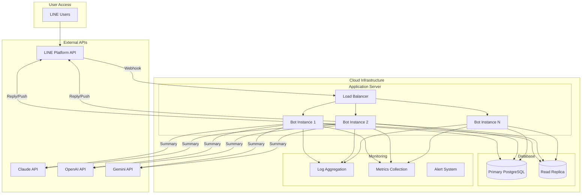

# C4 Architecture Diagrams

## C4 Model Overview

The C4 model provides a simple way to model software architecture, focusing on the context, containers, components, and code.

---

## Context Diagram

### Level 1: System Context

### Description

The LINE Bot Summarizer sits between LINE users/groups and AI services. It:
1. Receives messages from LINE via webhooks
2. Stores messages in PostgreSQL
3. Generates summaries using Claude, OpenAI, or Gemini
4. Sends summaries back to LINE users/groups

---

## Container Diagram

### Level 2: Container View

### Container Descriptions

| Container | Technology | Responsibility |
|-----------|------------|----------------|
| Web Server | Axum + Rust | Handle webhooks, commands, health checks |
| Scheduler | tokio-cron-scheduler | Manage scheduled summary jobs |
| PostgreSQL | SQLx | Store and retrieve messages |
| Configuration | dotenv + Environment | Manage settings and API keys |

---

## Component Diagram

### Level 3: Component View

```mermaid
graph TB
    subgraph "Web Server Container"
        subgraph "Web Layer"
            Router[Router]
            WebhookHandler[Webhook Handler]
            HealthCheck[Health Check]
        end

        subgraph "Application Layer"
            CommandParser[Command Parser]
            MessageProcessor[Message Processor]
            ProfileService[Profile Service]
        end

        subgraph "Data Layer"
            DBPool[Connection Pool]
            MessageRepo[Message Repository]
        end

        subgraph "Integration Layer"
            LineClient[LINE API Client]
            AIService[AI Service Factory]
        end

        subgraph "AI Implementations"
            Claude[Claude Service]
            OpenAI[OpenAI Service]
            Gemini[Gemini Service]
        end
    end

    subgraph "Scheduler Container"
        ScheduleLoader[Schedule Loader]
        CronRunner[Cron Runner]
        JobExecutor[Job Executor]
    end

    subgraph "External"
        LINE_API[LINE Messaging API]
        Claude_API[Claude API]
        OpenAI_API[OpenAI API]
        Gemini_API[Gemini API]
        DB[(PostgreSQL)]
    end

    %% Web Layer
    Router -->|Route| WebhookHandler
    Router -->|Route| HealthCheck

    %% Application Layer
    WebhookHandler -->|Parse| CommandParser
    WebhookHandler -->|Process| MessageProcessor
    MessageProcessor -->|Lookup| ProfileService

    %% Data Layer
    MessageProcessor -->|Store| MessageRepo
    MessageProcessor -->|Retrieve| MessageRepo
    CommandParser -->|Retrieve| MessageRepo
    MessageRepo -->|Query| DBPool
    DBPool -->|Connection| DB

    %% Integration Layer
    MessageProcessor -->|Reply| LineClient
    ProfileService -->|Fetch| LineClient
    AIService -->|Create| Claude
    AIService -->|Create| OpenAI
    AIService -->|Create| Gemini

    %% AI Implementations
    Claude -->|Call API| Claude_API
    OpenAI -->|Call API| OpenAI_API
    Gemini -->|Call API| Gemini_API

    %% Scheduler
    ScheduleLoader -->|Load| CronRunner
    CronRunner -->|Trigger| JobExecutor
    JobExecutor -->|Retrieve| MessageRepo
    JobExecutor -->|Generate| AIService
    JobExecutor -->|Push| LineClient

    %% External
    WebhookHandler -->|Verify| LINE_API
    LineClient -->|Reply| LINE_API
    LineClient -->|Push| LINE_API
```

### Component Descriptions

#### Web Layer

| Component | File | Responsibility |
|-----------|-------|----------------|
| Router | `main.rs` | HTTP routing, state management |
| Webhook Handler | `line/webhook.rs` | Event processing, signature verification |
| Health Check | `main.rs` | System health endpoint |

#### Application Layer

| Component | File | Responsibility |
|-----------|-------|----------------|
| Command Parser | `handlers/summary.rs` | Parse summary commands and parameters |
| Message Processor | `main.rs` | Orchestrate message storage and commands |
| Profile Service | `line/client.rs` | Fetch user/group member profiles |

#### Data Layer

| Component | File | Responsibility |
|-----------|-------|----------------|
| Connection Pool | `db/pool.rs` | PostgreSQL connection management |
| Message Repository | `db/models.rs` | CRUD operations for messages |

#### Integration Layer

| Component | File | Responsibility |
|-----------|-------|----------------|
| LINE API Client | `line/client.rs` | LINE Messaging API communication |
| AI Service Factory | `ai/mod.rs` | Create appropriate AI provider instance |

#### AI Implementations

| Component | File | Responsibility |
|-----------|-------|----------------|
| Claude Service | `ai/claude.rs` | Claude API integration |
| OpenAI Service | `ai/openai.rs` | OpenAI API integration |
| Gemini Service | `ai/gemini.rs` | Gemini API integration |

---

## Code Diagram

### Level 4: Code View - Webhook Handler

### Code View - Summary Command

### Code View - AI Service

### Code View - Scheduler

---

## Data Flow - C4 Level 2

### Deep Data Flow

---

## Deployment View

### Production Deployment

### Deployment Components

| Component | Technology | Count | Responsibility |
|-----------|------------|--------|----------------|
| Load Balancer | Nginx/Cloud LB | 1+ | Distribute traffic |
| App Instances | Docker/Rust | 2+ | Handle requests |
| Database | PostgreSQL | 2+ | Data storage |
| Monitoring | Prometheus/Grafana | 1+ | Observability |

---

## C4 Model Key

| Element | Symbol | Description |
|---------|---------|-------------|
| Person | 👤 | User/actor interacting with system |
| System | 🌐 | Software system at highest level |
| Container | 📦 | Standalone unit (application/service) |
| Component | ⚙️ | Part of a container |
| Database | 💾 | Database or data store |
| External | 🌐 | External system/service |

---

## Diagram Legend

### Notation

- **Boxes**: Represent systems, containers, components
- **Lines**: Represent relationships/data flow
- **Arrow Direction**: Data flow direction
- **Subgraphs**: Logical grouping of elements

### Line Types

| Line Style | Meaning |
|------------|---------|
| `-->` | Synchronous call |
| `-->|` | Asynchronous call |
| `..>` | Implementation/inheritance |
| `--` | Dependency |

---

## Notes

- All diagrams follow C4 Model principles
- Simplicity over detail at higher levels
- Progressive disclosure: more detail at lower levels
- Focus on value delivery and user interactions
- Render using Mermaid-compatible tools
