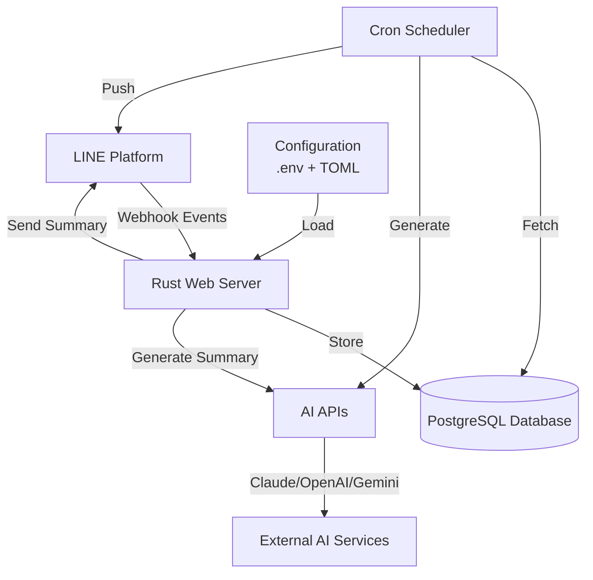
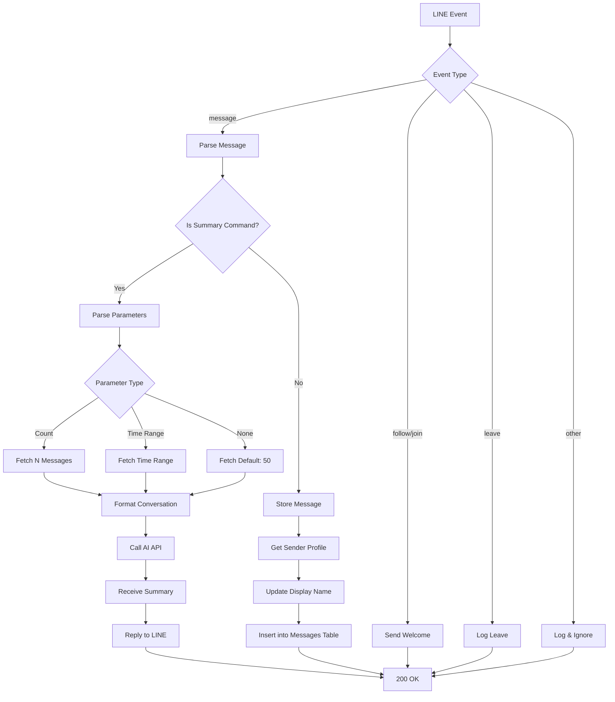
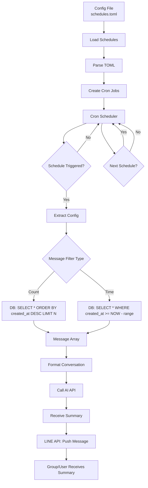
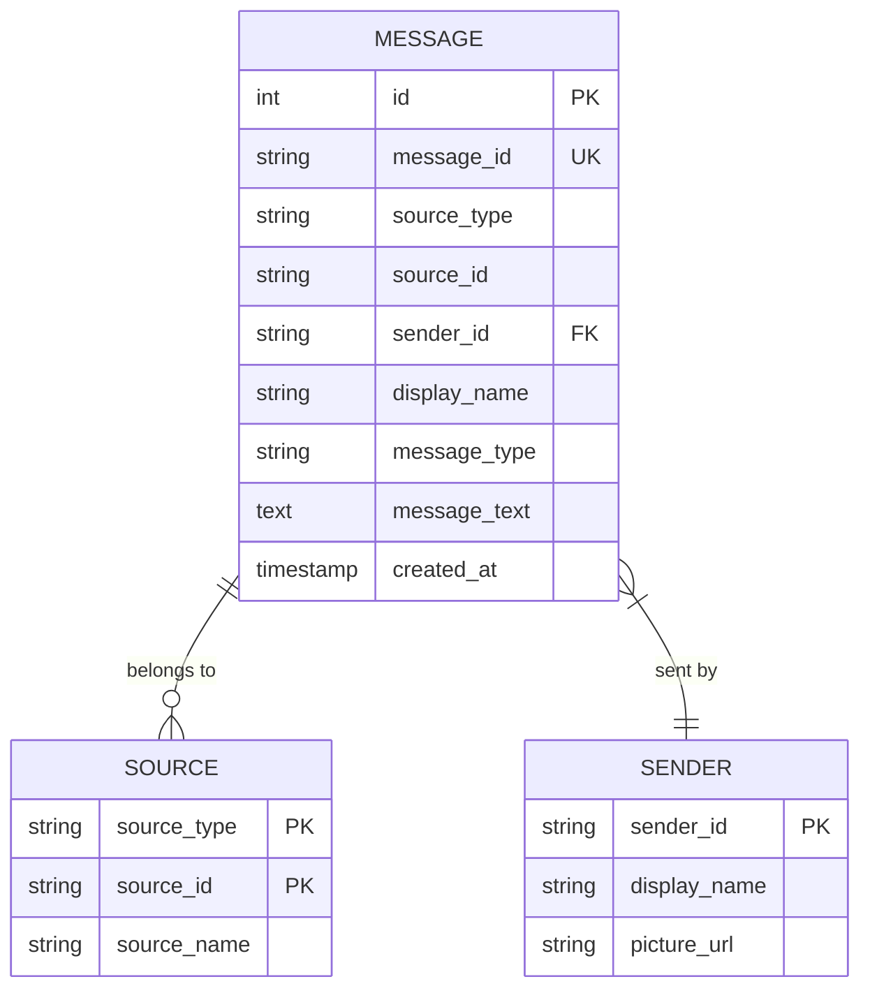
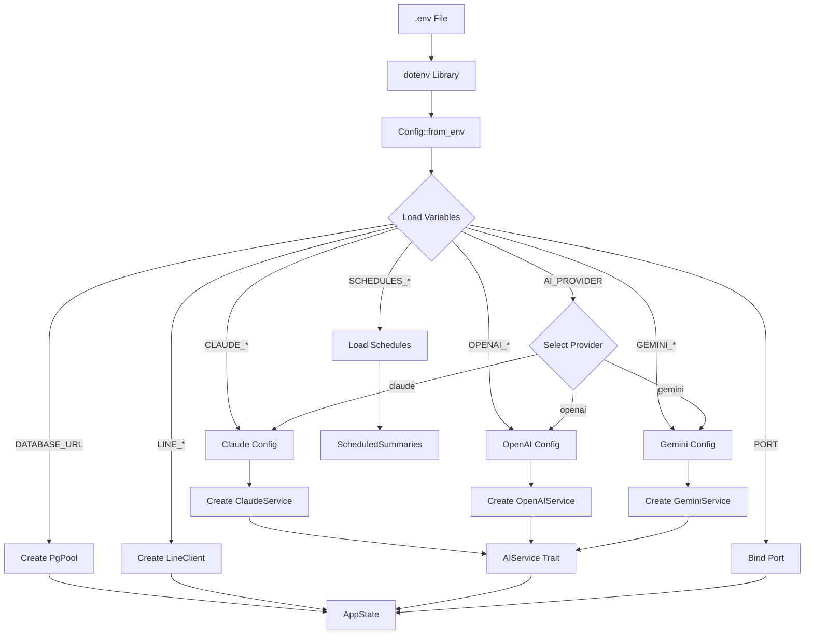
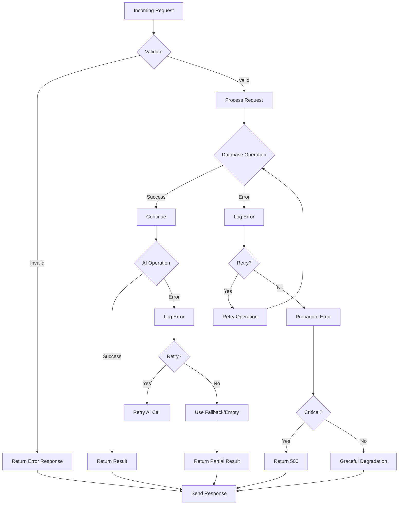
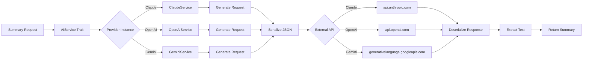
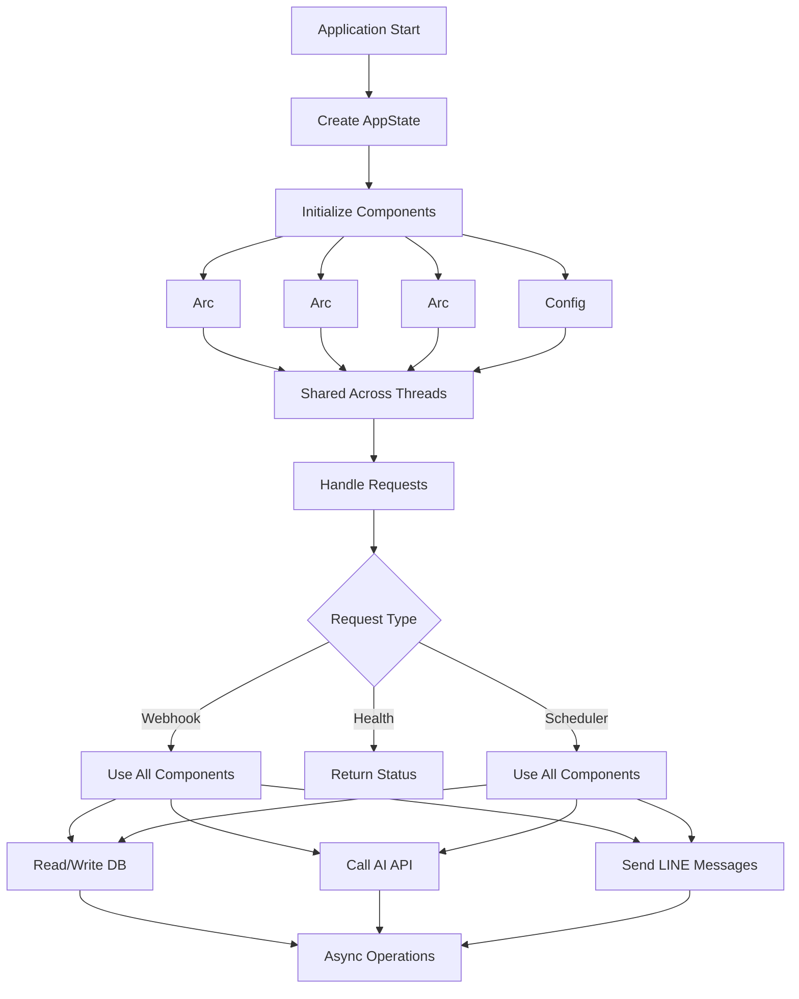

# Data Flow Diagrams

## Table of Contents
1. [System Overview](#system-overview)
2. [Webhook Data Flow](#webhook-data-flow)
3. [Summary Generation Flow](#summary-generation-flow)
4. [Scheduled Summary Flow](#scheduled-summary-flow)
5. [Database Data Flow](#database-data-flow)
6. [Configuration Flow](#configuration-flow)
7. [Error Handling Flow](#error-handling-flow)

---

## System Overview

### High-Level Data Flow



### Component Interactions

| Component | Receives From | Sends To | Data Type |
|-----------|---------------|-----------|------------|
| LINE Platform | User | Webhook | Webhook events |
| Webhook | LINE, DB, AI | LINE, DB, AI | Messages, summaries |
| Database | Webhook, Scheduler | Webhook, Scheduler | Message data |
| AI Services | Webhook, Scheduler | Webhook, Scheduler | AI responses |
| Scheduler | Config | DB, AI, LINE | Schedule triggers |
| Configuration | - | Webhook, Scheduler | Environment vars |

---

## Webhook Data Flow

### Detailed Flow Diagram



### Data Transformations

| Step | Input | Transformation | Output |
|-------|--------|----------------|---------|
| Webhook Verification | Body + Secret | HMAC-SHA256 → Base64 |
| Command Parsing | Raw text | Parsed command + parameters |
| Message Storage | Event data | Database record |
| Profile Lookup | User ID | Display name string |
| Conversation Format | Messages | Single string with timestamps |
| AI Call | Conversation string | Summary text |

---

## Summary Generation Flow

### Data Flow Diagram

```mermaid
graph LR
    A[Summary Command] --> B[Parser]
    B --> C[Parameter Extraction]
    C --> D{Parameter Type}

    D -->|Count| E[DB Query: LIMIT N]
    D -->|Time| F[DB Query: created_at >= NOW - range]
    D -->|None| G[DB Query: LIMIT 50]

    E --> H[Message Records]
    F --> H
    G --> H

    H --> I[Filter: Text Only]
    I --> J[Sort: Created ASC]
    J --> K[Format: [Name Time]: Text]

    K --> L[AI Service]
    L --> M{Provider Type}

    M -->|Claude| N[Claude API]
    M -->|OpenAI| O[OpenAI API]
    M -->|Gemini| P[Gemini API]

    N --> Q[Thai Summary]
    O --> Q
    P --> Q

    Q --> R[Reply to LINE]
```

### Data Models

**Message Record**:
```rust
struct Message {
    id: i32,
    message_id: String,
    source_type: SourceType,      // user/group/room
    source_id: String,             // user/group/room ID
    sender_id: Option<String>,
    display_name: Option<String>,
    message_type: MessageType,     // text/image/sticker
    message_text: Option<String>,
    created_at: DateTime<Utc>,
}
```

**Conversation Format**:
```
[Alice 10:02]: Hello everyone!
[Bob 10:05]: Hi Alice, how are you?
[Charlie 10:10]: Good morning!
```

---

## Scheduled Summary Flow

### Data Flow Diagram



### Schedule Configuration

**TOML Format**:
```toml
[[schedules]]
source_type = "group"
source_id = "C456def"
cron = "0 18 * * *"
message_count = 100
```

**Parsed Data**:
```rust
struct Schedule {
    source_type: String,      // "group", "user", "room"
    source_id: String,       // Target ID
    cron: String,           // Cron expression
    message_count: Option<i32>,
    time_range: Option<String>,
}
```

---

## Database Data Flow

### Entity Relationship Diagram



### Query Flows

**Store Message**:
```sql
INSERT INTO messages (
    message_id,
    source_type,
    source_id,
    sender_id,
    display_name,
    message_type,
    message_text
) VALUES ($1, $2, $3, $4, $5, $6, $7)
ON CONFLICT (message_id) DO NOTHING
```

**Fetch Recent Messages**:
```sql
SELECT *
FROM messages
WHERE source_type = $1 AND source_id = $2
ORDER BY created_at DESC
LIMIT $3
```

**Fetch by Time Range**:
```sql
SELECT *
FROM messages
WHERE source_type = $1
  AND source_id = $2
  AND created_at >= NOW() - INTERVAL '1 minute' * $3
ORDER BY created_at ASC
```

---

## Configuration Flow

### Environment Variables Flow



### Configuration Sources

| Source | Variables | Used By |
|---------|------------|----------|
| Environment | DATABASE_URL, PORT | Web server |
| Environment | LINE_CHANNEL_ACCESS_TOKEN, LINE_CHANNEL_SECRET | LINE client |
| Environment | AI_PROVIDER, CLAUDE_*, OPENAI_*, GEMINI_* | AI services |
| TOML File | Schedules configuration | Scheduler |

---

## Error Handling Flow

### Error Propagation Diagram



### Error Categories

| Error Type | Example | Handling Strategy |
|-------------|---------|------------------|
| Input Validation | Invalid command | Return error message |
| Database | Connection lost | Retry, log, return error |
| LINE API | Rate limit | Exponential backoff |
| AI API | Timeout | Retry once, return timeout message |
| Configuration | Missing env var | Crash on startup |

---

## AI Service Data Flow

### Provider Abstraction Flow



### Request/Response Data Structures

**Claude Request**:
```json
{
  "model": "claude-sonnet-4-6",
  "max_tokens": 4096,
  "messages": [
    {
      "role": "user",
      "content": "prompt..."
    }
  ]
}
```

**Claude Response**:
```json
{
  "id": "msg_...",
  "content": [
    {
      "text": "summary..."
    }
  ]
}
```

---

## State Management Flow

### Application State



### State Sharing

| Component | Type | Access Pattern | Thread Safety |
|-----------|------|----------------|---------------|
| Database Pool | Arc<PgPool> | Shared, read/write | Thread-safe via Arc |
| LINE Client | Arc<LineClient> | Shared, read/write | Thread-safe via Arc |
| AI Service | Arc<dyn AIService> | Shared, read | Thread-safe via Arc |
| Config | Config | Clone per thread | No sharing needed |

---

## Notes

- All diagrams use Mermaid syntax
- Render in GitHub, VSCode with Mermaid extension
- Data flows show transformations at each step
- Error flows highlight failure paths
- Async operations indicated with parallel notation where applicable
