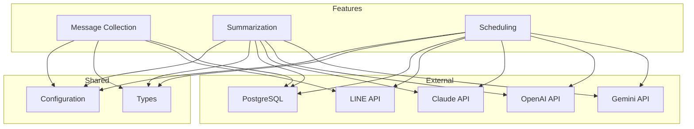

# Feature-Sliced Design (FSD)

## FSD Overview

Feature-Sliced Design is a methodology for structuring code based on business features rather than technical layers. Each feature is a self-contained module with its own domain logic, API, and implementation.

---

## Directory Structure

```
src/
├── shared/              # Cross-feature utilities
│   ├── config/         # Configuration management
│   └── types/          # Shared type definitions
│
├── features/            # Business features
│   ├── message-collection/
│   │   ├── api/       # Public API (types, functions)
│   │   ├── lib/       # Core business logic
│   │   ├── ui/        # UI/presentation (CLI/Web)
│   │   └── config/    # Feature-specific config
│   │
│   ├── summarization/
│   │   ├── api/
│   │   ├── lib/
│   │   └── providers/ # AI provider implementations
│   │
│   └── scheduling/
│       ├── api/
│       ├── lib/
│       └── config/
│
├── entities/           # Domain entities (data models)
│   └── message/
│       ├── model.rs
│       ├── repository.rs
│       └── types.rs
│
└── kernel/            # Core application setup
    ├── main.rs
    ├── server.rs
    └── app.rs
```

---

## Feature 1: Message Collection

### Purpose
Capture and store all LINE messages from user, group, and room conversations.

### Domain Entity
**Location**: `src/entities/message/model.rs`

```rust
pub struct Message {
    pub id: MessageId,
    pub message_id: MessageId,
    pub source_type: SourceType,
    pub source_id: SourceId,
    pub sender_id: Option<UserId>,
    pub display_name: Option<String>,
    pub message_type: MessageType,
    pub message_text: Option<String>,
    pub created_at: DateTime<Utc>,
}
```

### Public API
**Location**: `src/features/message-collection/api/mod.rs`

```rust
// Types
pub struct SaveMessageRequest {
    pub message_id: MessageId,
    pub source_type: SourceType,
    pub source_id: SourceId,
    pub sender_id: Option<UserId>,
    pub message_type: MessageType,
    pub message_text: Option<String>,
}

pub struct SaveMessageResponse {
    pub success: bool,
    pub message_id: MessageId,
}

// Functions
pub async fn save_message(
    pool: &PgPool,
    request: SaveMessageRequest,
) -> Result<SaveMessageResponse>;

pub async fn get_messages_by_count(
    pool: &PgPool,
    source: Source,
    count: u32,
) -> Result<Vec<Message>>;

pub async fn get_messages_by_time_range(
    pool: &PgPool,
    source: Source,
    minutes: u32,
) -> Result<Vec<Message>>;
```

### Business Logic
**Location**: `src/features/message-collection/lib/mod.rs`

```rust
pub struct MessageCollector {
    pool: Arc<PgPool>,
    profile_fetcher: Arc<ProfileFetcher>,
}

impl MessageCollector {
    pub async fn collect(&self, event: LineEvent) -> Result<()> {
        // 1. Validate event
        // 2. Extract message data
        // 3. Fetch sender profile
        // 4. Store in database
    }

    async fn fetch_sender_profile(
        &self,
        sender_id: &UserId,
        source: &Source,
    ) -> Result<Option<String>>;
}
```

### Configuration
**Location**: `src/features/message-collection/config/mod.rs`

```rust
pub struct MessageCollectionConfig {
    pub retry_attempts: u32,
    pub profile_cache_ttl: Duration,
    pub bulk_insert_size: usize,
}

impl Default for MessageCollectionConfig {
    fn default() -> Self {
        Self {
            retry_attempts: 3,
            profile_cache_ttl: Duration::from_secs(300),
            bulk_insert_size: 100,
        }
    }
}
```

---

## Feature 2: Summarization

### Purpose
Generate conversation summaries using AI providers.

### Domain Types
**Location**: `src/entities/summary/types.rs`

```rust
pub struct SummaryRequest {
    pub source: Source,
    pub messages: Vec<Message>,
    pub language: Language,
}

pub struct SummaryResponse {
    pub summary: String,
    pub model: String,
    pub provider: AIProvider,
}

pub enum Language {
    Thai,
    English,
}

pub enum AIProvider {
    Claude,
    OpenAI,
    Gemini,
}
```

### Public API
**Location**: `src/features/summarization/api/mod.rs`

```rust
// Types
pub struct GenerateSummaryRequest {
    pub source: Source,
    pub count: Option<u32>,
    pub time_range: Option<TimeRange>,
}

pub struct GenerateSummaryResponse {
    pub summary: String,
    pub message_count: u32,
    pub generation_time: Duration,
}

// Functions
pub async fn generate_summary(
    pool: &PgPool,
    ai_service: &dyn AIService,
    request: GenerateSummaryRequest,
) -> Result<GenerateSummaryResponse>;
```

### Business Logic
**Location**: `src/features/summarization/lib/mod.rs`

```rust
pub struct SummaryService {
    pool: Arc<PgPool>,
    ai_service: Arc<dyn AIService>,
}

impl SummaryService {
    pub async fn generate(
        &self,
        request: GenerateSummaryRequest,
    ) -> Result<GenerateSummaryResponse> {
        // 1. Fetch messages based on count/time range
        // 2. Filter text messages only
        // 3. Format as conversation string
        // 4. Build prompt (Thai)
        // 5. Call AI API
        // 6. Parse and return response
    }

    fn format_conversation(&self, messages: &[Message]) -> String;
    fn build_prompt(&self, conversation: &str) -> String;
}
```

### AI Provider Implementations
**Location**: `src/features/summarization/providers/`

**Claude**:
```rust
pub struct ClaudeProvider {
    api_key: String,
    model: String,
}

impl AIService for ClaudeProvider {
    async fn generate_summary(&self, conversation: &str) -> Result<String> {
        // Call Claude API
        // Handle errors
        // Return summary
    }
}
```

**OpenAI**:
```rust
pub struct OpenAIProvider {
    api_key: String,
    model: String,
}

impl AIService for OpenAIProvider { /* ... */ }
```

**Gemini**:
```rust
pub struct GeminiProvider {
    api_key: String,
    model: String,
}

impl AIService for GeminiProvider { /* ... */ }
```

---

## Feature 3: Scheduling

### Purpose
Manage automatic summary generation at scheduled times.

### Domain Entity
**Location**: `src/entities/schedule/model.rs`

```rust
pub struct Schedule {
    pub id: ScheduleId,
    pub source_type: SourceType,
    pub source_id: SourceId,
    pub cron_expression: CronExpression,
    pub message_count: Option<u32>,
    pub time_range: Option<TimeRange>,
    pub enabled: bool,
}

pub struct CronExpression {
    pub minute: u8,
    pub hour: u8,
    pub day_of_month: u8,
    pub month: u8,
    pub day_of_week: u8,
}

pub struct TimeRange {
    pub value: u32,
    pub unit: TimeUnit,
}

pub enum TimeUnit {
    Minutes,
    Hours,
    Days,
}
```

### Public API
**Location**: `src/features/scheduling/api/mod.rs`

```rust
// Types
pub struct LoadSchedulesRequest {
    pub config_path: PathBuf,
}

pub struct LoadSchedulesResponse {
    pub schedules: Vec<Schedule>,
    pub loaded: u32,
}

// Functions
pub async fn load_schedules(
    path: &Path,
) -> Result<LoadSchedulesResponse>;

pub async fn add_schedule(
    scheduler: &mut JobScheduler,
    schedule: Schedule,
) -> Result<JobId>;

pub async fn remove_schedule(
    scheduler: &mut JobScheduler,
    job_id: JobId,
) -> Result<()>;
```

### Business Logic
**Location**: `src/features/scheduling/lib/mod.rs`

```rust
pub struct ScheduleManager {
    pool: Arc<PgPool>,
    line_client: Arc<LineClient>,
    ai_service: Arc<dyn AIService>,
    scheduler: JobScheduler,
}

impl ScheduleManager {
    pub async fn start(&mut self, config_path: &Path) -> Result<()> {
        // 1. Load schedules from TOML
        // 2. Create cron jobs
        // 3. Start scheduler
    }

    async fn execute_job(&self, schedule: &Schedule) -> Result<()> {
        // 1. Fetch messages per schedule
        // 2. Generate summary
        // 3. Push to LINE
    }
}
```

### Configuration
**Location**: `src/features/scheduling/config/mod.rs`

```toml
# config/schedules.toml
[[schedules]]
source_type = "group"
source_id = "C456def"
cron = "0 18 * * *"
message_count = 100

[[schedules]]
source_type = "user"
source_id = "U123abc"
cron = "0 9 * * 1-5"
time_range = "24h"
```

---

## Shared Layer

### Types
**Location**: `src/shared/types/mod.rs`

```rust
// ID Types
pub type MessageId = String;
pub type UserId = String;
pub type SourceId = String;
pub type JobId = Uuid;

// Domain Types
pub struct Source {
    pub source_type: SourceType,
    pub source_id: SourceId,
}

pub enum SourceType {
    User,
    Group,
    Room,
}

pub enum MessageType {
    Text,
    Image,
    Video,
    Audio,
    Sticker,
    File,
    Location,
}
```

### Configuration
**Location**: `src/shared/config/mod.rs`

```rust
pub struct AppConfig {
    pub database_url: String,
    pub line_access_token: String,
    pub line_channel_secret: String,
    pub ai_provider: AIProvider,
    pub claude_api_key: Option<String>,
    pub claude_model: String,
    pub openai_api_key: Option<String>,
    pub openai_model: String,
    pub gemini_api_key: Option<String>,
    pub gemini_model: String,
    pub port: u16,
}

pub fn load_from_env() -> Result<AppConfig>;
```

---

## Kernel Layer

### Application Setup
**Location**: `src/kernel/app.rs`

```rust
pub struct Application {
    state: Arc<AppState>,
    router: Router,
}

impl Application {
    pub async fn new() -> Result<Self> {
        // 1. Load configuration
        // 2. Initialize database pool
        // 3. Create AI service
        // 4. Create LINE client
        // 5. Setup scheduler
        // 6. Build router
    }

    pub async fn run(self, port: u16) -> Result<()> {
        // 1. Bind to port
        // 2. Start server
        // 3. Handle shutdown
    }
}
```

### Server Setup
**Location**: `src/kernel/server.rs`

```rust
pub struct Server {
    listener: TcpListener,
    router: Router,
}

impl Server {
    pub async fn bind(port: u16) -> Result<Self>;
    pub async fn serve(self) -> Result<()>;
    pub fn routes() -> Router {
        // Webhook endpoint
        // Health check endpoint
    }
}
```

---

## Feature Dependencies

### Dependency Graph



---

## FSD Principles Applied

### 1. Feature-Based Organization
- Code organized by business capability
- Each feature is independent and self-contained
- Easy to locate feature implementation

### 2. Clear Public API
- Each feature has `api/` module
- Well-defined types and functions
- Other features interact via public API only

### 3. Shared Layer
- Common types in `shared/types/`
- Configuration in `shared/config/`
- No circular dependencies

### 4. Domain-Driven
- Entities represent business concepts
- Business logic in feature `lib/`
- External interactions abstracted

### 5. Testability
- Each feature can be tested independently
- Mock external dependencies
- Unit, integration, and E2E tests

---

## Migration Path

### Current → FSD

| Current | FSD | Action |
|---------|-------|--------|
| `src/db/` | `src/entities/message/` | Move models |
| `src/line/` | `src/shared/line/` | Move client |
| `src/ai/` | `src/features/summarization/providers/` | Move AI services |
| `src/handlers/` | `src/features/summarization/lib/` | Move command logic |
| `src/scheduler/` | `src/features/scheduling/` | Keep as feature |
| `src/config.rs` | `src/shared/config/` | Move config |

### Benefits

1. **Scalability**: Easy to add new features
2. **Maintainability**: Clear code organization
3. **Reusability**: Shared components across features
4. **Testability**: Independent feature testing
5. **Onboarding**: New developers understand structure quickly

---

## Notes

- FSD is recommended for larger teams and long-term projects
- Current implementation is more traditional layer-based
- Consider FSD for future refactoring
- Maintain backward compatibility during migration
