# Sequence Diagrams

## Table of Contents
1. [Message Flow: User Sends Message](#message-flow-user-sends-message)
2. [Message Flow: Summary Request](#message-flow-summary-request)
3. [Message Flow: Scheduled Summary](#message-flow-scheduled-summary)
4. [Authentication Flow: Webhook Verification](#authentication-flow-webhook-verification)
5. [Profile Lookup Flow](#profile-lookup-flow)

---

## Message Flow: User Sends Message

### Diagram

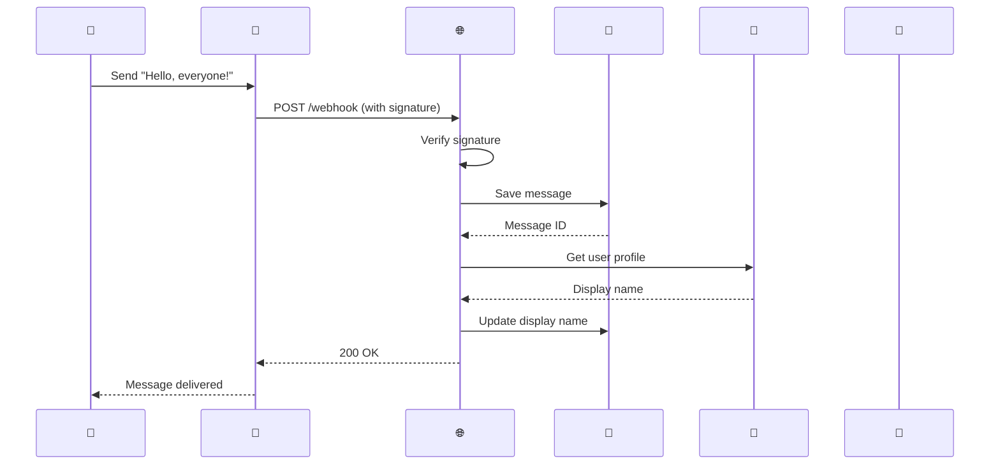

### Description

1. User sends a message in LINE chat
2. LINE Platform sends webhook event to bot
3. Bot verifies webhook signature
4. Bot stores message in PostgreSQL
5. Bot fetches sender's display name from LINE API
6. Bot updates message with display name
7. Bot responds with 200 OK

### Notes

- Message is stored even if profile fetch fails
- Display name lookup is asynchronous
- Webhook signature must match channel secret

---

## Message Flow: Summary Request

### Diagram

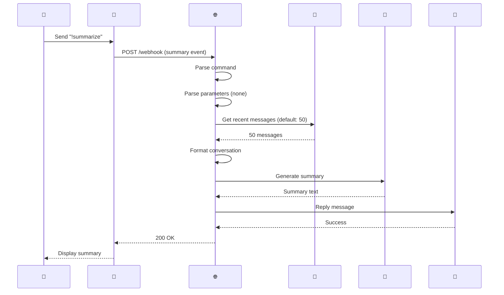

### Description

1. User sends `!summarize` command
2. LINE sends webhook with message event
3. Bot detects summary command
4. Bot fetches 50 recent messages from database
5. Bot formats messages as conversation string
6. Bot sends conversation to AI API
7. AI returns summary in Thai
8. Bot replies to user with summary

### Variations

**With Message Count** (`!summarize 100`)
```
Webhook->>DB: Get 100 messages
```

**With Time Range** (`!summarize 2h`)
```
Webhook->>DB: Get messages from last 2 hours
```

**Thai Command** (`/สรุป`)
```
User->>LINE: Send "/สรุป"
// Rest of flow identical
```

---

## Message Flow: Scheduled Summary

### Diagram

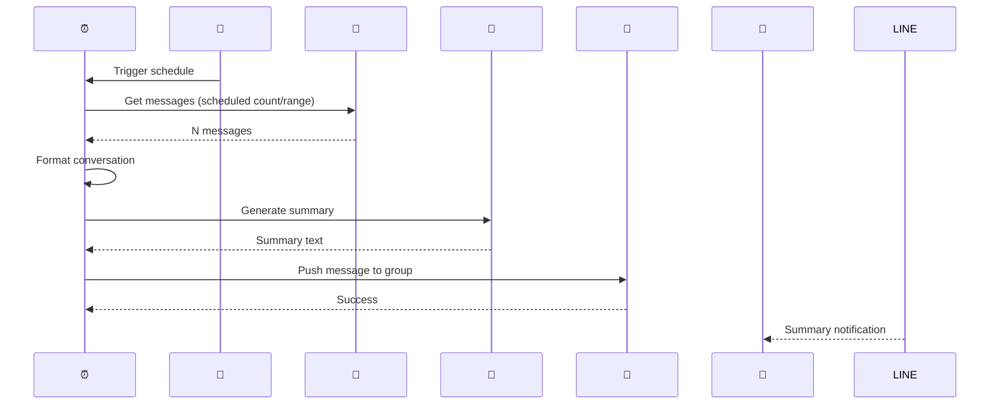

### Description

1. Cron scheduler triggers at scheduled time
2. Scheduler reads schedule configuration
3. Fetches messages based on configuration
4. Formats as conversation string
5. Generates summary via AI
6. Pushes summary to group/user via LINE API
7. User receives summary notification

### Notes

- Push messages are not replies to a webhook
- Push messages count toward LINE API quota
- Failed schedules should be logged but not crash

---

## Authentication Flow: Webhook Verification

### Diagram

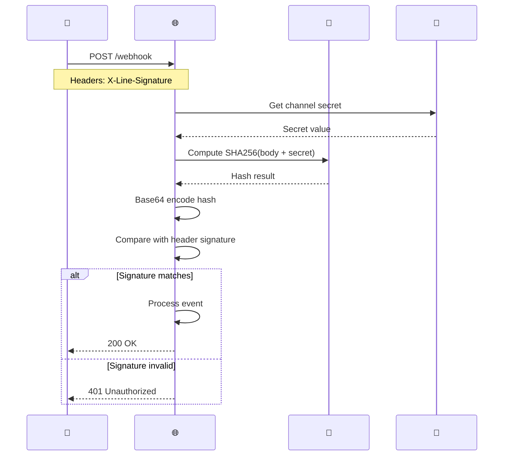

### Algorithm

```
signature = base64(hmac_sha256(channel_secret, request_body))
```

### Security Benefits

- **Authentication**: Only LINE can send valid requests
- **Integrity**: Body cannot be modified in transit
- **Non-repudiation**: Proves request came from LINE

---

## Profile Lookup Flow

### Diagram

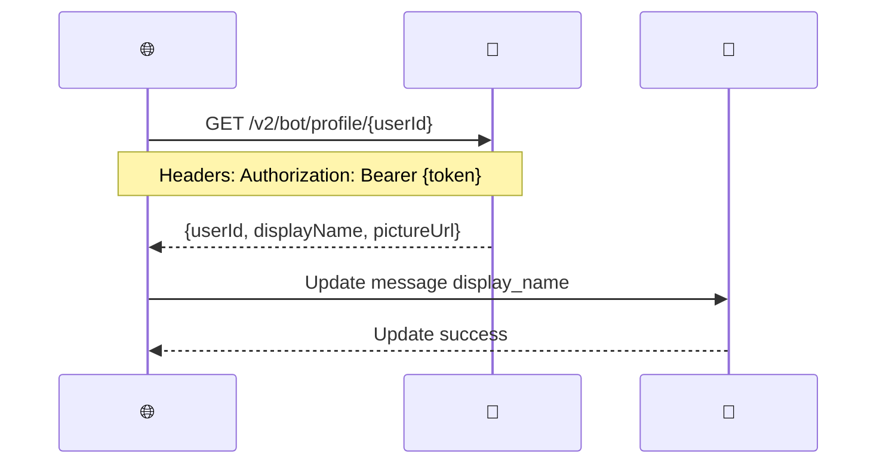

### Group Member Profile

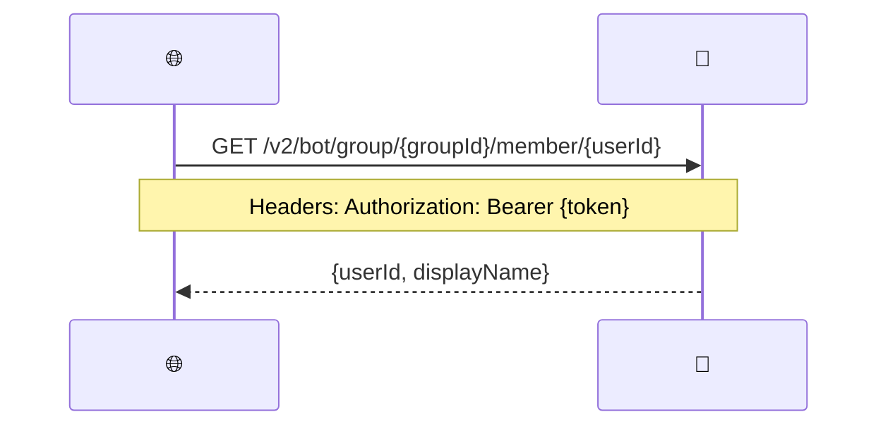

### Error Handling

| Scenario | Action |
|-----------|---------|
| Profile fetch succeeds | Update message with display name |
| Profile fetch fails | Log warning, continue without display name |
| Bot not in group | Profile unavailable, skip update |
| Rate limit exceeded | Retry after delay, log warning |

---

## AI Provider Selection Flow

### Diagram

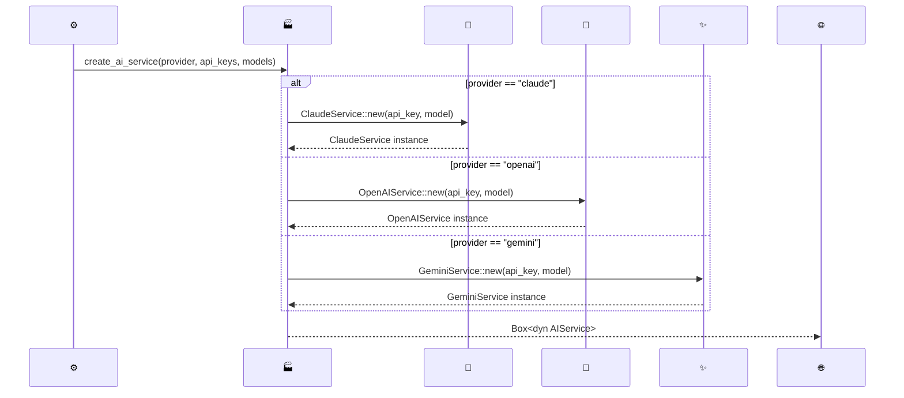

---

## Startup Sequence

### Diagram

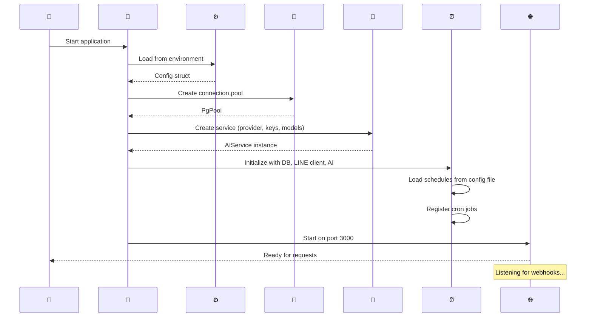

---

## Shutdown Sequence

### Diagram

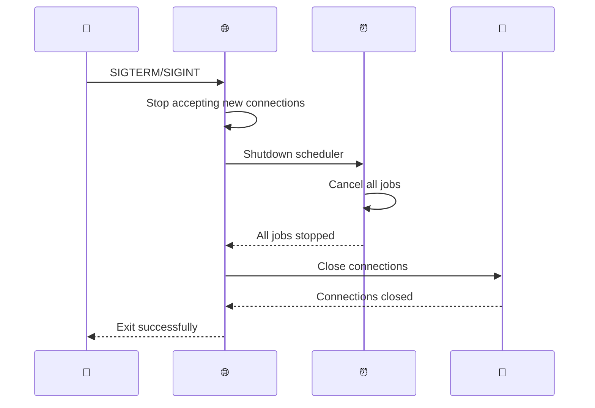

---

## Error Handling Sequence

### Diagram (Webhook Error)

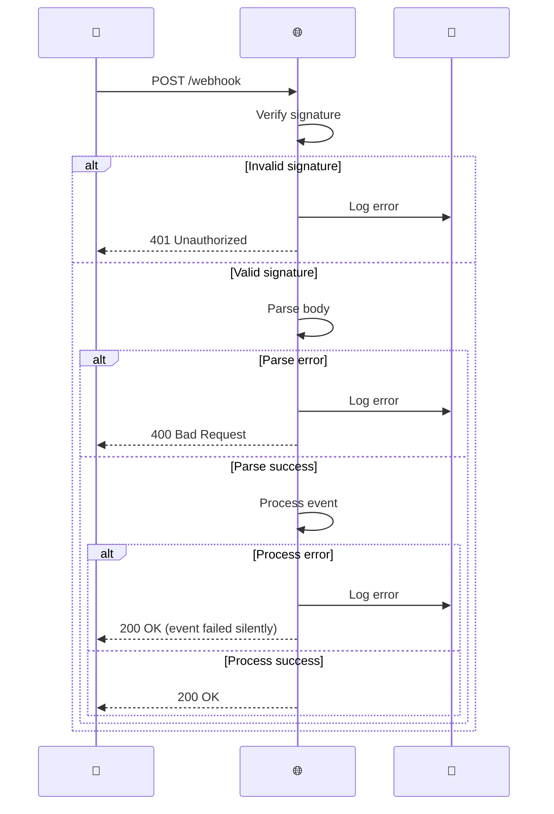

### Diagram (AI Error)

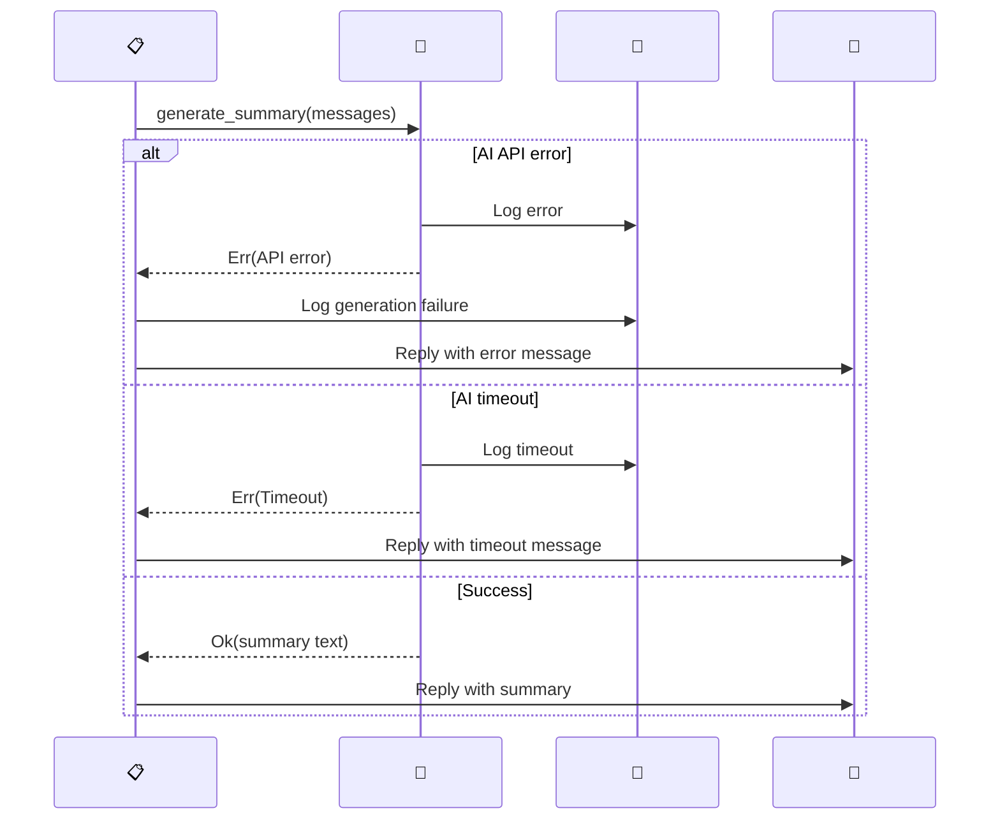

---

## Notes

- All sequence diagrams use Mermaid syntax
- Can be rendered in GitHub, GitLab, VSCode with Mermaid extension
- Timestamps and async operations shown where relevant
- Error paths included for robustness understanding
